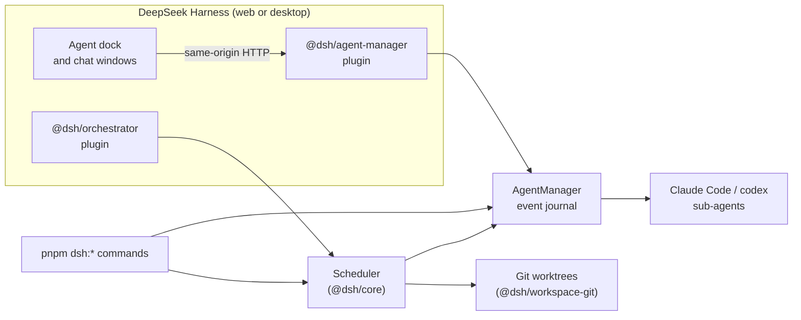

# DSH Multi-Agent Orchestrator

**English** | [简体中文](README.zh-CN.md)


A multi-agent orchestration plugin for [DeepSeek Harness](https://github.com/deepseek-ai/deepseek-harness) (DSH),
built around one question: **when you upgrade an agent role, did it actually get better?**

Roles are treated as versioned assets. You can call a role for a specific scenario, compare two versions of
it on the same task from the same starting point under the same checks, and run roles inside governed
workflows with isolated worktrees, checks, and protected merges. Inside DSH, an **Agent** dock lists the
sub-agents of the current project and lets you chat with them in floating windows.

> [!NOTE]
> The project is experimental (version 0.1) and not published to npm. Calling roles, running workflows and
> comparing roles start real Claude Code / codex processes and **spend model quota**. Role definitions and
> most of the detailed documentation are written in Chinese.

## Features

| What | Entry point | Notes |
| --- | --- | --- |
| Call a role | `pnpm dsh:call-role <roleId> "<task>" [--scenario <name>]` | Guided mode: start one sub-agent (Claude Code or codex), give it one task, get its reply and the role's self-check |
| List roles | `pnpm dsh:call-role --list` | Roles, their scenarios and the third-party tools they declare |
| Run a workflow | `pnpm dsh:start-workflow <workflowId> --input task="..."` | Governed mode: one worktree per step, workspace setup, step checks, path policy, ordered merges; the result waits on an integration ref for review |
| Compare two role versions | `pnpm dsh:compare-roles <manifest> --baseline git:<ref> --candidate <dir>` | Same task, same base commit, same visible and hidden checks, arms in a seeded random order; writes a traceable comparison record |
| Inspect a comparison | `pnpm dsh:eval-bundle` | Produces a blinded evidence bundle that can be reviewed by a separate evaluator |
| Agents inside DSH | the `@dsh/agent-manager` plugin | Agent dock: per-project list, floating chat windows with Markdown replies, tool calls, thinking/retry status; drafts and window positions survive a reload |

## How it fits together



The code follows a strict three-layer split:

- **Kernel** (`@dsh/spec`, `@dsh/core`): state machines, ports and protocol types in plain TypeScript, with no
  dependency on DSH or Cordis, testable with fake drivers.
- **Harness plugins** (`@dsh/orchestrator`, `@dsh/agent-manager`, `@dsh/comm-eventbus`): thin Cordis plugins that
  expose kernel capabilities as services. They hold no business logic.
- **Skills** (role YAML, workflow packs): content only, never a source of runtime identity or authority.

The public repository intentionally contains the reusable framework only. Role YAML files, project layers,
workflow packs, evaluation records, runtime journals and private documentation stay in the host project.

## Requirements

| Software | Used for | Check |
| --- | --- | --- |
| Node.js ≥ 20 | runtime | `node --version` |
| pnpm 10 (the repository pins `pnpm@10.34.5`) | package manager | `pnpm --version` |
| git | worktree isolation, candidate commits, merges | `git --version` |
| Claude Code CLI | `claude-code` sub-agents | `claude --version` |
| codex CLI (optional) | `codex` sub-agents | `codex --version` |
| DeepSeek Harness (optional) | the Agent dock inside DSH | `dsh --version` |

## Quick start

```bash
git clone https://github.com/zzz-push/dsh-multi-agent-orchestrator.git
cd dsh-multi-agent-orchestrator
pnpm install
pnpm build          # TypeScript build + the bundle for the Agent window in DSH
pnpm test
```

Check the setup without starting any model:

```bash
pnpm dsh:call-role --list         # roles, scenarios, declared third-party tools
pnpm dsh:start-workflow --list    # workflow packs
pnpm demo:comm                    # communication layer + in-process event bus
pnpm demo:run                     # run state machine and scheduling, with fake drivers
```

Then put one of your own roles to work (this spends quota):

```bash
pnpm dsh:call-role <roleId> "Explain how packages/core schedules a batch of steps"

# Governed workflow: implement a task with the workflow pack provided by your host project.
pnpm dsh:start-workflow <workflow-id> --input task="..." --harness claude-code
pnpm dsh:start-workflow --status <runId>
```

Each role names the harness it runs on (`execution.harness` in its YAML); `dsh:start-workflow` can override it
with `--harness`. Claude sub-agents default to Sonnet at medium effort.

## Use it inside DeepSeek Harness

Link the plugin packages into a DSH profile and list them as bundles. The repository's plugin
configuration holds no machine-specific paths; settings for your machine (for example absolute paths to
`claude` / `codex` when the desktop app cannot see your shell's `PATH`) go in your profile's own
`cordis.patch.yml`.

After `pnpm build`, reload DSH. The **Agent** button in the bottom-right corner opens the list of the current
project's agents; double-click one to open its chat window. The plugin's HTTP routes serve only the DSH page
itself and refuse requests started by other web sites (see
[`packages/agent-manager/README.md`](packages/agent-manager/README.md)).

## Roles, policies and skills

- `.dsh/roles/*.yaml`: roles supplied by the host project. They are intentionally not included in this public
  framework repository.
- `.dsh/project-layer/*.yaml`: host-project additions such as background, scenarios and verification rules.
  These are also intentionally private.
- `.dsh/skills/dsh-author-role-or-workflow/SKILL.md`: the reusable authoring skill included in this export.
- Third-party tools (MCP servers) must be **declared by the role**; the project policy (`.dsh/policy.yaml`)
  decides whether to allow them, and `~/.dsh/mcp-servers.yaml` says how to start them on this machine. An agent
  gets exactly the tools that are declared, allowed and launchable.
- Every start records the role hash and the project-layer hash in the event journal, so a comparison record
  can say exactly which version ran.

Copy `.dsh/policy.yaml.example` to `.dsh/policy.yaml` and tailor the allowlists before running agents.
The example is intentionally restrictive; without a policy file the runtime allows everything (a development fallback).

### What the policy enforces, and what it does not

- `.dsh/policy.yaml` binds the **harness**, the **sandbox mode** and the **MCP servers** an agent gets. A listed
  value is an allowlist (anything else is downgraded to the first allowed value and journaled as a
  `policy.violation`); an empty list (`[]`) prohibits the category, and an agent that would need it does not
  start; an omitted field allows everything (except `allowedShellPatterns`, where omitted means none). A role that declares no sandbox gets the first allowed mode, not the harness's own default. Without a
  policy file everything is allowed — a development fallback, not a security boundary.
- `allowedFileOperations` and `allowedShellPatterns` are only checked against what a role *declares* and
  recorded as violations; nothing yet stops an agent's tools from doing more. Bound what an agent can do with
  its sandbox mode.
- Claude sub-agents load only your user-level Claude settings, never the `.claude/settings*.json` of the project
  they run in, so a repository cannot widen an agent's permissions or add hooks.
  `read-only` runs Claude in `dontAsk` mode (reading and searching work, anything else is refused unless
  pre-approved), so it does not depend on the `defaultMode` in your own settings either.
- **Running DSH on a repository runs that repository's code as you, outside any agent sandbox**: workflow
  `workspace.setup` and step `checks`, task-manifest commands, and MCP servers defined in its `.dsh/policy.yaml`.
  Setup and checks also run whatever earlier steps merged (a `postinstall` script, a test file). Use DSH on
  repositories you trust, and keep `paths.allow_changes` away from files the next setup or check executes.

## Packages

| Package | Responsibility |
| --- | --- |
| `@dsh/spec` | protocols, capability matrix, role / scenario / project-layer types, base errors |
| `@dsh/communication` | communication provider registry, capability preflight, leases and draining |
| `@dsh/comm-eventbus` | in-process send / request / subscribe provider |
| `@dsh/core` | run state machine, scheduler (concurrent batches, ordered merges, cancellation, leases), workflow compiler, file persistence |
| `@dsh/workspace-git` | git worktree isolation, candidate commits, CAS merges, workspace setup, check execution |
| `@dsh/agent-manager` | sub-agent lifecycle, channels (Claude Code / codex), event journal, roles and project layers, policy, the Agent window in DSH |
| `@dsh/orchestrator` | Cordis plugin exposing the registry, scheduler and run repository as services |
| `@dsh/role-eval` | role version comparison and evidence bundles |
| `@dsh/harness-runtime`, `@dsh/client` | placeholders, no content yet |

<details>
<summary>Minimal example: the communication layer as a library</summary>

```ts
import { CommunicationRegistryImpl, createMessage } from '@dsh/communication'
import { EventBusProvider } from '@dsh/comm-eventbus'

const registry = new CommunicationRegistryImpl()
const unregister = registry.register(new EventBusProvider())

const lease = await registry.acquire({
  provider: 'event-emitter',
  requirements: { requestReply: true },
  runId: 'run-001',
})

lease.port.subscribe(
  (message) => message.type === 'progress',
  (message) => console.log(message.payload),
)

await lease.port.send(createMessage({
  runId: 'run-001',
  type: 'progress',
  sender: 'worker',
  payload: { percent: 50 },
}))

await lease.release()
unregister()
registry.dispose()
```

`acceptedAt` only means the provider accepted the message locally, not that the receiver handled it. The
authoritative run state still belongs in the persisted `RunAggregate`.

</details>

## Development

```bash
pnpm build           # tsc -b over the project references + the Agent window bundle
pnpm typecheck
pnpm test            # vitest, whole workspace
pnpm test:coverage   # fails below 80% statements / lines / functions
pnpm --filter @dsh/core test                               # one package
pnpm --filter @dsh/core exec vitest run test/scheduler.test.ts   # one file
```

Temporary implementations should be tracked by the host project in its own issue or maintenance register.

## License

MIT. See [LICENSE](LICENSE).
