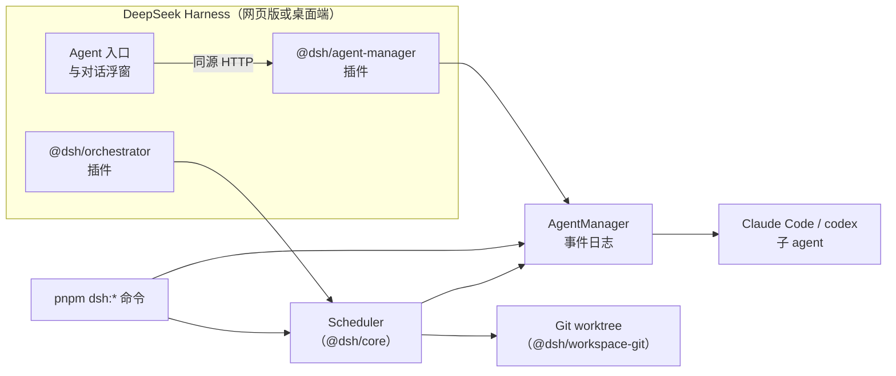

# DSH Multi-Agent Orchestrator

[English](README.md) | **简体中文**


给 [DeepSeek Harness](https://github.com/deepseek-ai/deepseek-harness)（DSH）用的多 Agent 编排插件，核心问题是：
**一个角色升级之后，到底有没有变好？**

它把角色当作版本化的资产：可以按场景调用一个角色；可以让同一个角色的两个版本在同样的起点、同样的检查下
做同一个任务，对比结果；也可以把角色放进有隔离 worktree、有检查、有合并保护的工作流里执行。在 DSH 里，
页面右下角的 **Agent** 入口会列出当前项目的子 agent，可以在浮窗里和它们对话。

> [!NOTE]
> 项目处于实验阶段（0.1 版），没有发布到 npm。调用角色、跑工作流、做角色对比都会启动真实的
> Claude Code / codex 进程，**消耗模型额度**。

## 能做什么

| 能力 | 入口 | 说明 |
| --- | --- | --- |
| 调用一个角色 | `pnpm dsh:call-role <roleId> "<任务>" [--scenario <名字>]` | 引导模式：起一个子 agent（Claude Code 或 codex），发一个任务，取回回复和角色自检结果 |
| 查看角色 | `pnpm dsh:call-role --list` | 列出角色、每个角色的场景和声明的第三方工具 |
| 跑一个工作流 | `pnpm dsh:start-workflow <workflowId> --input task="..."` | 治理模式：每一步独立 worktree、工作区准备、步骤检查、路径策略、按顺序合并，结果放在集成 ref 上待审查 |
| 对比两个角色版本 | `pnpm dsh:compare-roles <manifest> --baseline git:<ref> --candidate <dir>` | 同一任务、同一起点、同样的可见/隐藏检查，两臂按种子随机排序，出可追溯的对比记录 |
| 查看对比证据 | `pnpm dsh:eval-bundle` | 生成盲化证据包，可交给独立评估器审阅 |
| 在 DSH 里看 Agent | `@dsh/agent-manager` 插件 | Agent 入口：按项目列出 agent，浮窗对话（回复按 Markdown 显示）、工具调用、思考/重试状态；草稿和窗口位置刷新后保留 |

## 整体结构



代码严格分成三层：

- **内核**（`@dsh/spec`、`@dsh/core`）：状态机、端口和协议类型，纯 TypeScript，不依赖 DSH 或 Cordis，
  可以用假驱动测试。
- **Harness 插件**（`@dsh/orchestrator`、`@dsh/agent-manager`、`@dsh/comm-eventbus`）：很薄的 Cordis 插件，
  把内核能力暴露成服务，不含业务逻辑。
- **Skill**（角色 YAML、工作流包）：只是内容，不作为运行时身份或权限的来源。

公开仓库只包含可复用的框架。角色 YAML、项目层、工作流包、评估记录、运行日志和项目内部文档留在宿主项目中。

## 前置要求

| 软件 | 用途 | 检查 |
| --- | --- | --- |
| Node.js ≥ 20 | 运行时 | `node --version` |
| pnpm 10（仓库锁定 `pnpm@10.34.5`） | 包管理 | `pnpm --version` |
| git | worktree 隔离、候选提交、合并 | `git --version` |
| Claude Code CLI | `claude-code` 子 agent | `claude --version` |
| codex CLI（可选） | `codex` 子 agent | `codex --version` |
| DeepSeek Harness（可选） | 在 DSH 里使用 Agent 入口 | `dsh --version` |

## 快速开始

```bash
git clone https://github.com/zzz-push/dsh-multi-agent-orchestrator.git
cd dsh-multi-agent-orchestrator
pnpm install
pnpm build          # TypeScript 构建 + DSH 里 Agent 窗口的前端 bundle
pnpm test
```

不启动任何模型，先确认环境正常：

```bash
pnpm dsh:call-role --list         # 角色、场景、声明的第三方工具
pnpm dsh:start-workflow --list    # 工作流包
pnpm demo:comm                    # 通讯层 + 进程内事件总线
pnpm demo:run                     # Run 状态机与调度（假驱动）
```

然后让你自己的角色干活（会消耗额度）：

```bash
pnpm dsh:call-role <roleId> "解释一下 packages/core 是怎么调度一批步骤的"

# 治理模式的工作流：使用宿主项目提供的工作流包执行任务。
pnpm dsh:start-workflow <workflow-id> --input task="..." --harness claude-code
pnpm dsh:start-workflow --status <runId>
```

每个角色在自己的 YAML 里写明跑在哪个 harness 上（`execution.harness`）；`dsh:start-workflow` 可以用
`--harness` 覆盖。Claude 子 agent 默认用 Sonnet、medium effort。

## 在 DeepSeek Harness 里使用

把三个插件包 link 进一个 DSH profile，并列进 bundles。仓库里的插件配置不含任何本机路径；本机专属的设置
（例如桌面端看不到 shell 的 `PATH` 时，`claude` / `codex` 的绝对路径）写在 profile 自己的
`cordis.patch.yml` 里。

`pnpm build` 之后刷新 DSH。页面右下角的 **Agent** 按钮会打开当前项目的 agent 列表，双击一行打开对话浮窗。
插件的 HTTP 接口只为 DSH 页面本身服务，会拒绝其他网站发起的请求（见
[`packages/agent-manager/README.md`](packages/agent-manager/README.md)）。

## 角色、策略与 Skill

- `.dsh/roles/*.yaml`：由宿主项目提供的角色。公开框架仓库故意不包含它们。
- `.dsh/project-layer/*.yaml`：宿主项目给角色补充的背景、场景和校验，公开框架仓库同样不包含。
- `.dsh/skills/dsh-author-role-or-workflow/SKILL.md`：本公开导出包含的通用角色/工作流编写 Skill。
- 角色要用的**第三方工具**（MCP 服务器）必须写在角色定义里；项目策略（`.dsh/policy.yaml`）决定放不放行，
  本机的启动命令写在 `~/.dsh/mcp-servers.yaml`。agent 只会拿到声明过、被允许、并且能启动的工具。
- 每次启动都在事件日志里记录角色哈希和项目层哈希，对比记录据此说明"跑的是哪一版"。

运行前请把 `.dsh/policy.yaml.example` 复制成 `.dsh/policy.yaml`，再按宿主项目的实际需求填写允许列表。
示例策略故意偏严格；没有策略文件时运行时全部允许（开发用的兜底）。

### 策略管住了什么，没管住什么

- `.dsh/policy.yaml` 约束 agent 拿到的 **harness**、**沙箱模式**和 **MCP 服务器**。列出若干项是白名单（请求别的会降级到
  第一个允许的值，并在 journal 里记一条 `policy.violation`）；空列表（`[]`）表示这一类全部禁止，需要它的 agent 不会启动；
  删掉字段表示全部允许（`allowedShellPatterns` 例外：删掉表示全部禁止）。角色没声明沙箱时用允许列表里的第一个模式，不交给 harness 自己的默认值。没有策略文件时全部允许——这是开发用的兜底，
  不是安全边界。
- `allowedFileOperations` 和 `allowedShellPatterns` 只用来核对角色**声明**的内容并记录违规，目前还不限制 agent 的工具
  实际能做什么。要限制 agent，靠沙箱模式。
- Claude 子 agent 只加载你用户级的 Claude 设置，不加载它所在项目的 `.claude/settings*.json`，仓库没法借此放宽 agent 的
  权限或加 hooks。`read-only` 在 Claude 上以 `dontAsk` 模式运行（能读能搜，其余没预先批准的一律拒绝），也不受你自己设置里
  `defaultMode` 的影响。
- **在一个仓库上运行 DSH，就是以你的身份、在任何 agent 沙箱之外运行这个仓库的代码**：工作流的 `workspace.setup` 和步骤
  `checks`、任务 manifest 里的命令、它 `.dsh/policy.yaml` 里定义的 MCP 服务器都会执行。setup 和 checks 还会执行前面步骤
  合并进来的内容（`postinstall` 脚本、测试文件）。只在你信任的仓库上用 DSH，并让 `paths.allow_changes` 避开下一次 setup
  或检查会执行的文件。

## 包

| 包 | 职责 |
| --- | --- |
| `@dsh/spec` | 协议、能力矩阵、角色/场景/项目层类型、错误基类 |
| `@dsh/communication` | 通讯 Provider 注册表、能力预检、租约和 draining |
| `@dsh/comm-eventbus` | 进程内 send/request/subscribe Provider |
| `@dsh/core` | Run 状态机、Scheduler（并发批次、按序合并、取消、租约）、工作流编译器、文件持久化 |
| `@dsh/workspace-git` | Git worktree 隔离、候选提交、CAS 合并、工作区准备、检查执行 |
| `@dsh/agent-manager` | 子 agent 生命周期、Channel（Claude Code / codex）、事件日志、角色与项目层、策略、DSH 里的 Agent 窗口 |
| `@dsh/orchestrator` | 把 Registry / Scheduler / RunRepository 暴露为 Cordis Service 的插件 |
| `@dsh/role-eval` | 角色版本对比与证据包 |
| `@dsh/harness-runtime`、`@dsh/client` | 占位，暂无内容 |

<details>
<summary>最小示例：把通讯层当作库来用</summary>

```ts
import { CommunicationRegistryImpl, createMessage } from '@dsh/communication'
import { EventBusProvider } from '@dsh/comm-eventbus'

const registry = new CommunicationRegistryImpl()
const unregister = registry.register(new EventBusProvider())

const lease = await registry.acquire({
  provider: 'event-emitter',
  requirements: { requestReply: true },
  runId: 'run-001',
})

lease.port.subscribe(
  (message) => message.type === 'progress',
  (message) => console.log(message.payload),
)

await lease.port.send(createMessage({
  runId: 'run-001',
  type: 'progress',
  sender: 'worker',
  payload: { percent: 50 },
}))

await lease.release()
unregister()
registry.dispose()
```

`acceptedAt` 只表示 Provider 本地接受了消息，不表示接收方已处理。Run 的权威状态仍应持久化到 `RunAggregate`。

</details>

## 开发

```bash
pnpm build           # 按项目引用跑 tsc -b，并构建 Agent 窗口的 bundle
pnpm typecheck
pnpm test            # vitest，整个工作区
pnpm test:coverage   # 语句 / 行 / 函数覆盖率低于 80% 即失败
pnpm --filter @dsh/core test                               # 单个包
pnpm --filter @dsh/core exec vitest run test/scheduler.test.ts   # 单个文件
```

宿主项目可以在自己的 issue 或维护登记中记录临时实现；这些项目记录不属于公开框架。

## 许可证

MIT，详见 [LICENSE](LICENSE)。
